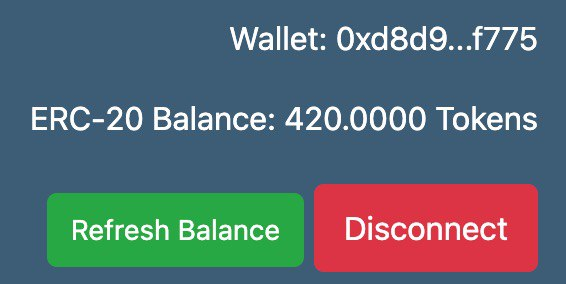
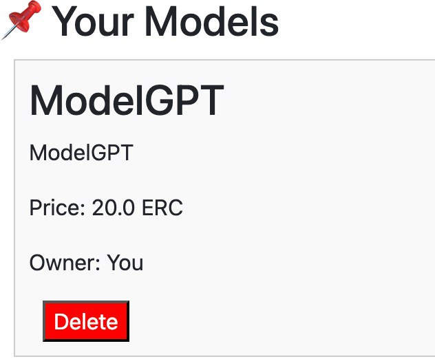
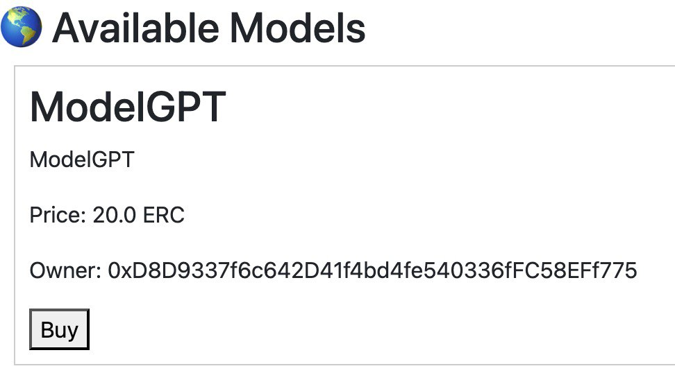

# AI Model Marketplace

A decentralized marketplace for AI models where users can list, buy, and rate AI models using ERC-20 tokens. This platform enables secure transactions and community-driven quality assessment through a rating system.

## Features

- Connect/disconnect MetaMask wallet
- List AI models for sale with name, description, and price
- Buy models using ERC-20 tokens
- Rate purchased models (1-5 stars)
- View your listed models
- Track model sales and ratings
- Real-time token balance display
- Delete your listed models
- View all available and sold models

## Demo Screenshots

Here's a visual walkthrough of the main features:


*Token balance check and wallet connection*


*Interface for listing a new AI model*


*Model display in the marketplace*


*Model view for potential buyers*


*View of a sold model with rating system*

## Technology Stack

- Frontend: React.js with React Router
- Smart Contract Integration: ethers.js
- Styling: Bootstrap & Custom CSS Modules
- Wallet Integration: MetaMask
- Network: Ganache (supports any EVM-compatible network)

## Prerequisites

- Node.js (v14 or higher)
- MetaMask wallet extension
- ERC-20 tokens for transactions
- Access to an Ganache network (mainnet, testnet, or local)

## Installation

1. Clone the repository:
```bash
git clone https://github.com/nur1kesh/ai-model-marketplace
cd ai-model-marketplace/frontend
```

2. Install dependencies:
```bash
npm install
```

3. Configure environment:
   - Create a `config.js` file in the `src` directory
   - Add your contract addresses and ABIs:
```javascript
export const CONTRACT_ADDRESS = "your_marketplace_contract_address";
export const TOKEN_ADDRESS = "your_token_contract_address";
export const CONTRACT_ABI = [...]; // Your marketplace contract ABI
export const TOKEN_ABI = [...];    // Your token contract ABI
```

4. Start the development server:
```bash
npm start
```

## Usage Guide

### Connecting Your Wallet

1. Click the "Connect Wallet" button in the navigation bar
2. Approve the MetaMask connection request
3. Your account address and token balance will appear in the header

### Listing a Model

1. Navigate to the "List Model" page
2. Fill in the required fields:
   - Model Name
   - Description
   - Price (in ERC tokens)
   - Upload model file (supports .zip, .json, .h5, .onnx)
3. Click "List Model" to create the listing

### Buying a Model

1. Browse available models on the home page
2. Click "Buy Model" on any listing
3. Approve the token spending in MetaMask
4. Confirm the purchase transaction

### Rating a Model

1. Find the purchased model in the "Sold Models" section
2. Click the star rating (1-5 stars)
3. Click "Submit Rating" to record your rating

### Managing Your Models

- View your listed models in the "Your Models" section
- Delete unwanted listings using the "Delete" button
- Track sales and ratings of your models

## Smart Contract Integration

The marketplace uses two main smart contracts:

1. **ERC-20 Token Contract**
   - Handles token transfers for purchases
   - Manages token approvals and balances

2. **Marketplace Contract**
   - Manages model listings
   - Handles purchases
   - Stores ratings and reviews
   - Controls model ownership

## Project Structure

```
src/
├── components/
│   └── NavBar.js
├── pages/
│   ├── Home.js        # Main marketplace view
│   └── ListModel.js   # Model listing form
├── App.js             # Main application component
├── config.js          # Contract configuration
└── styles/            # CSS modules and styles
```

## Security Considerations

- All transactions require MetaMask confirmation
- Smart contract interactions are protected by ownership checks
- Token approvals are required before purchases
- Multiple security validations for listing and purchasing
- Wallet connection state is preserved securely

## Contributing

1. Fork the repository
2. Create a feature branch (`git checkout -b feature/AmazingFeature`)
3. Commit your changes (`git commit -m 'Add some AmazingFeature'`)
4. Push to the branch (`git push origin feature/AmazingFeature`)
5. Open a Pull Request

## License

This project is licensed under the MIT License - see the [LICENSE](LICENSE) file for details.