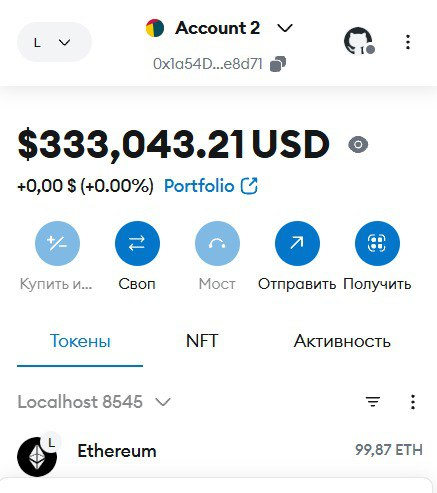
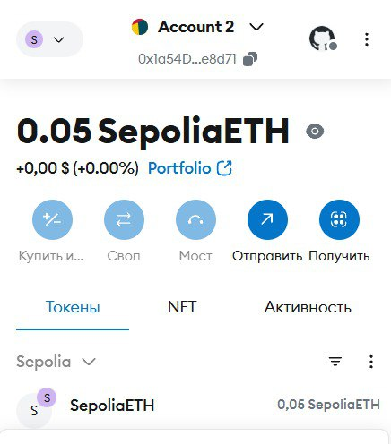
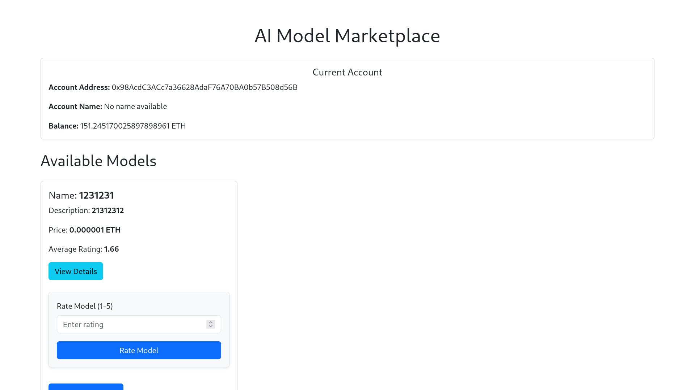
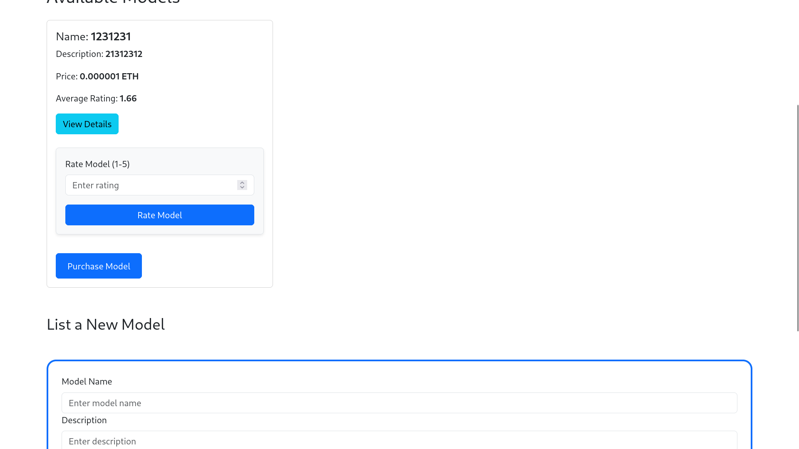
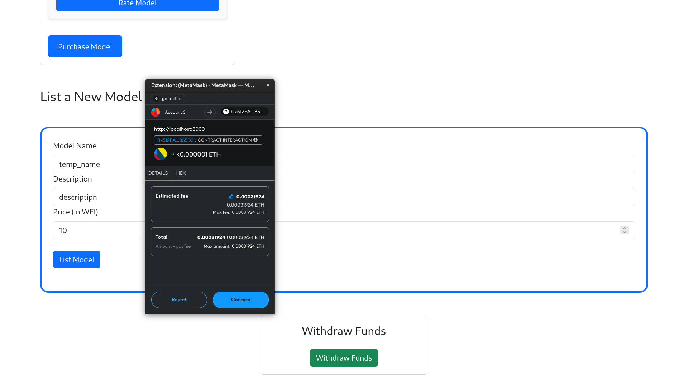
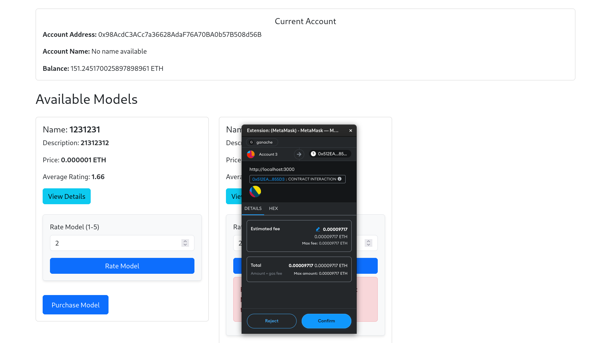
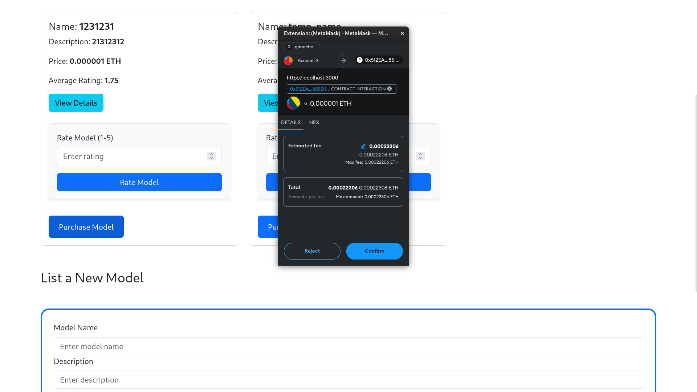
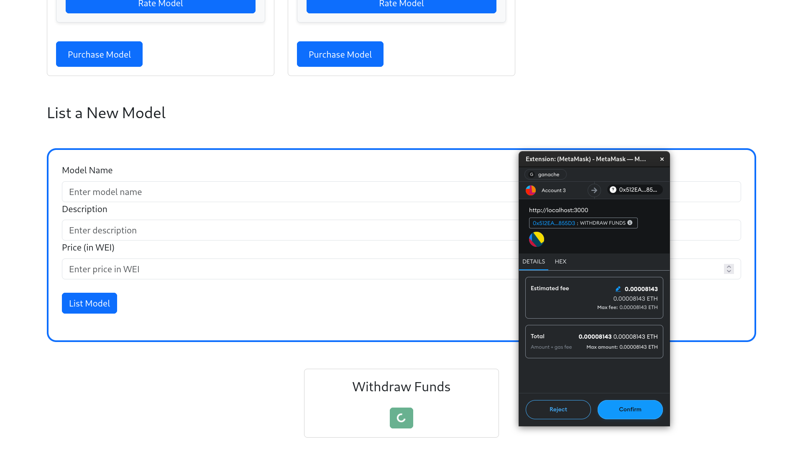

# AI Model Marketplace dApp

This dApp allows users to list, purchase, and rate AI models on a decentralized platform using the Ethereum blockchain.

---

## Usage

1. **Run Ganache**: Start the Ganache application to set up a local blockchain environment or connect to Sepolia via Infura (Testnet).

   
   

2. **Deploy the Smart Contract**: Use Truffle to deploy the smart contract. In your terminal, navigate to the project directory and run:
   ```bash
   truffle compile
   truffle migrate --network development
   ```

3. **Move Contract ABI**: After deployment, move the generated contract ABI from the build folder to the frontend:
   - ai-model-marketplace/frontend/src/abis/ContractABI.json

4. **Create env file in root dir**: 
    ```bash
    touch .env
    ```

5. **Copy Contract Address**: Copy the contract address from the Truffle migration output and paste it into your environment file as `CONTRACT_ADDRESS`.

6. **Move ABI to Frontend**: Copy the ABI from `AImodelMarketplace.json` to the frontend directory:
   ```bash
   cp ai-model-marketplace/build/contracts/AImodelMarketplace.json ai-model-marketplace/frontend/src/abis/ContractABI.json
   ```

7. **Start the Frontend**: Navigate to the frontend directory and start the application:
   ```bash
   cd ai-model-marketplace/frontend
   npm start
   ```

---

## Demo Screenshots

Here are some demo screenshots of the AI Model Marketplace dApp:









---

## Smart Contract Code

```solidity
// SPDX-License-Identifier: MIT
pragma solidity >=0.6.0 <0.9.0;

contract AImodelMarketplace {
    struct Model {
        string name;
        string description;
        uint256 price;
        address payable creator;
        address[] buyers; // Store buyers' addresses
        uint8 ratingCount;
        uint256 totalRating; // Using totalRating to manage float-like behavior
    }

    Model[] public models;
    mapping(uint256 => mapping(address => bool)) public hasPurchased; // Tracks if a user has purchased a model
    address public owner;

    event ModelListed(uint256 modelId, string name, address creator, uint256 price);
    event ModelPurchased(uint256 modelId, address buyer);
    event ModelRated(uint256 modelId, uint256 averageRating, address rater); // Change to uint256 for average rating
    event FundsWithdrawn(address owner, uint256 amount);

    constructor() {
        owner = msg.sender; // Set the contract creator as the owner
    }

    // Receive function to accept Ether
    receive() external payable {}

    // Function to list a new AI model
    function listModel(string memory name, string memory description, uint256 price) public payable {
        require(price > 0, "Price must be greater than zero");
        require(msg.value == price, "You must send the exact amount of Ether equal to the price");

        uint256 modelId = models.length;

        models.push(Model({
            name: name,
            description: description,
            price: price,
            creator: payable(msg.sender), // Correctly initialize as payable
            buyers: new address[](0), // Initialize buyers array correctly
            ratingCount: 0,
            totalRating: 0
        }));

        emit ModelListed(modelId, name, msg.sender, price);
    }

    function purchaseModel(uint256 modelId) public payable {
        require(modelId < models.length, "Model does not exist");
        Model storage model = models[modelId];
        require(msg.value == model.price, "Incorrect amount sent");
        require(model.creator != msg.sender, "Cannot purchase your own model");
        require(!hasPurchased[modelId][msg.sender], "You have already purchased this model");

        model.creator.transfer(msg.value); // Transfer the amount to the creator
        model.buyers.push(msg.sender); // Store buyer's address
        hasPurchased[modelId][msg.sender] = true; // Mark as purchased

        emit ModelPurchased(modelId, msg.sender);
    }

    // Function to rate a model
    function rateModel(uint256 modelId, uint8 rating) public {
        require(modelId < models.length, "Model does not exist");
        Model storage model = models[modelId];

        require(rating >= 1 && rating <= 5, "Rating must be between 1 and 5");
        require(model.creator != msg.sender, "Model creator cannot rate their own model");

        model.ratingCount++;
        model.totalRating += rating * 100; // Scale rating by 100 for two decimal precision

        emit ModelRated(modelId, getAverageRating(modelId), msg.sender);
    }

    // Function to calculate average rating
    function getAverageRating(uint256 modelId) public view returns (uint256) {
        Model storage model = models[modelId];
        return model.ratingCount > 0 ? model.totalRating / model.ratingCount : 0; // Returns average as a scaled uint256
    }

    // Function to withdraw funds from the contract
    function withdrawFunds() public {
        require(msg.sender == owner, "Only the owner can withdraw funds");
        uint256 balance = address(this).balance;
        require(balance > 0, "No funds to withdraw");

        // Transfer the contract balance to the owner
        payable(msg.sender).transfer(balance);
        emit FundsWithdrawn(msg.sender, balance);
    }

    // Function to get model details
    function getModelDetails(uint256 modelId) public view returns (string memory, string memory, uint256, address, uint256, address[] memory) {
        require(modelId < models.length, "Model does not exist");
        Model storage model = models[modelId];
        uint256 averageRating = getAverageRating(modelId); // Get average rating

        return (model.name, model.description, model.price, model.creator, averageRating, model.buyers);
    }

    // Function to get the total number of models
    function totalModels() public view returns (uint256) {
        return models.length;   
    }
}
```
---

## License

This project is licensed under the MIT License - see the [LICENSE](./LICENSE) file for details.