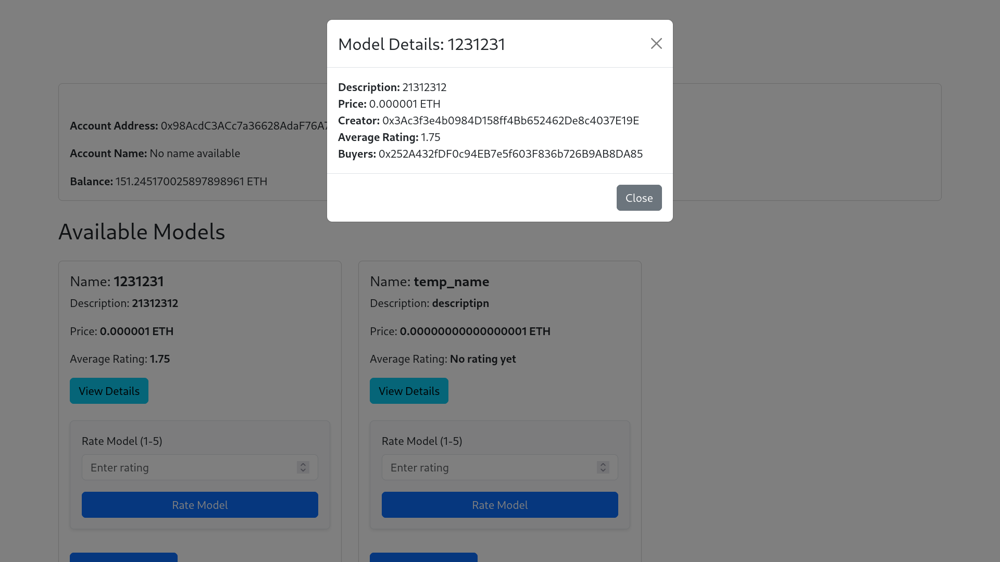

# AI Model Marketplace dApp

This decentralized application (dApp) allows users to list, purchase, and rate AI models on a marketplace platform using Ethereum and an ERC-20 token (AITU_Nurassyl). The marketplace allows creators to sell their models in exchange for ERC-20 tokens, while buyers can review and purchase AI models.

---

## Usage

1. **Run Ganache**: Start the Ganache application to set up a local blockchain environment or connect to Sepolia via Infura (Testnet).

   
   

2. **Deploy the Smart Contract**: Use Truffle to deploy the smart contract. In your terminal, navigate to the project directory and run:
   ```bash
   truffle compile
   truffle migrate --network development
   ```

3. **Move Contract ABI**: After deployment, move the generated contract ABI from the build folder to the frontend:
   - ai-model-marketplace/frontend/src/abis/ContractABI.json
   - ai-model-marketplace/frontend/src/abis/TokenABI.json

4. **Create env file in root dir**: 
    ```bash
    touch .env
    ```

5. **Copy Contract Address**: Copy the contract address from the Truffle migration output and paste it into your environment file as `CONTRACT_ADDRESS`.

6. **Move ABI to Frontend**: Copy the ABI from `AImodelMarketplace.json` & `AITU_Nurassyl.json` to the frontend directory:
   ```bash
   cp ai-model-marketplace/build/contracts/AImodelMarketplace.json ai-model-marketplace/frontend/src/abis/ContractABI.json
   cp ai-model-marketplace/build/contracts/AITU_Nurassyl.json ai-model-marketplace/frontend/src/abis/TokenABI.json
   ```

7. **Start the Frontend**: Navigate to the frontend directory and start the application:
   ```bash
   cd ai-model-marketplace/frontend
   npm start
   ```

---

## Key Features

### 1. **MetaMask Wallet Integration**:
- **Connect your wallet** using MetaMask to interact with the Ethereum blockchain.
- **View ERC-20 token balance**: Once connected, users can see their available balance of the custom ERC-20 token (AITU_Nurassyl) to purchase AI models.
- **Manage transactions**: Users can sign transactions to list models or purchase models directly from the marketplace.

### 2. **Listing AI Models**:
- **Sellers** can list their AI models for sale by providing:
  - **Model Name**: A unique name for the AI model.
  - **Model Description**: A brief description outlining the purpose of the AI model.
  - **Price** (in ERC-20 tokens): The price at which the model is being sold. Sellers can set the price in their preferred token.
- **Fee Handling**: The marketplace may include a fee structure in the smart contract, which could be a percentage of the sale price or a fixed fee, depending on your contract’s design.

### 3. **Purchasing AI Models**:
- **Buyers** can view the list of AI models, check detailed information, and purchase models using **ERC-20 tokens** (AITU_Nurassyl).
- The **purchase process** involves:
  - Approving the marketplace to transfer ERC-20 tokens from the buyer’s wallet.
  - The marketplace smart contract ensures that the buyer has sufficient tokens to make the purchase before completing the transaction.
  - **Instant purchase**: After a purchase, the model is marked as sold, and the transaction is completed, transferring the tokens from the buyer to the seller.

### 4. **Model Ratings**:
- **Buyers** can rate AI models on a scale of 1 to 5 **after purchasing**.
  - **Rating System**: Each rating contributes to the overall score of the model, giving potential buyers insight into the model’s quality.
  - The rating is stored and displayed on the marketplace.
  - **Average Rating**: The contract uses an aggregated rating system, storing individual ratings and calculating the average rating.

### 5. **Transaction Info**:
- Each **transaction** (purchase or listing) is tracked and visible within the platform.
- **Sender and Receiver Tracking**:
  - Track the sender and receiver of each transaction.
  - View transaction details such as the buyer, seller, amount, and timestamp.
- **Transaction Events**:
  - **Model Listed**: The event is triggered whenever a new model is listed for sale.
  - **Model Purchased**: When a model is bought, an event is emitted with the buyer’s and seller’s details.
  - **Model Rated**: When a model is rated, an event is emitted with the average rating.

### 6. **Smart Contract for Transactions**:
- **Smart contract logic** handles:
  - **Model listing**: Ensures that the model’s details are recorded on the blockchain.
  - **Model purchasing**: Ensures that funds are securely transferred and the model is marked as sold.
  - **Model rating**: Ensures that the rating is valid and updates the total rating for the model.
  - **Withdrawals**: Allows the contract owner (or specific addresses) to withdraw funds accumulated through sales or other mechanisms.

### 7. **Token-based Purchases**:
- All purchases are made using **ERC-20 tokens**, which can be bought, sold, or traded on various exchanges.
- The **ERC-20 token** (AITU_Nurassyl) is fully compatible with any wallet or dApp that supports ERC-20 tokens.
- **ERC-20 token interaction** is facilitated through:
  - `approve`: Allows the buyer to approve the marketplace contract to spend the specified amount of tokens.
  - `transfer`: The marketplace smart contract uses `transferFrom` to transfer tokens from the buyer to the seller.

### 8. **Withdrawal and Owner Control**:
- **Funds Withdrawal**: The contract owner can withdraw the funds from the smart contract at any time, which can include platform fees, contract balances, etc.
- **Admin rights**: The owner has exclusive rights to withdraw funds, ensuring that funds are securely managed.

### 9. **Decentralized Marketplace**:
- By using **Ethereum** and **smart contracts**, the marketplace operates without a centralized authority, enabling trustless and transparent transactions between buyers and sellers.
- **No intermediaries**: The contract ensures that once a model is listed, any buyer can purchase it without the need for intermediaries.

### 10. **Frontend User Interface**:
- **React.js** powers the frontend, providing a user-friendly interface for listing models, purchasing models, and interacting with the blockchain.
  - **MetaMask**: Integrated into the frontend for seamless interaction with the Ethereum network.
  - **Token balance** is displayed in the frontend, and buyers can see how many tokens they have available before making a purchase.

### 11. **Scalable and Secure**:
- The smart contract is designed for easy scaling, allowing the addition of more features such as:
  - **Admin management** of listed models.
  - **Escrow services** for holding funds until the buyer receives the model.
  - **Model ownership transfer** and more.

### 12. **Testable and Upgradable**:
- The entire system is designed to be testable with **unit tests** on the smart contract, ensuring the integrity and functionality of the marketplace logic.
- The system can be easily upgraded with new models or features, thanks to the flexibility of the smart contract and frontend architecture.

---

## Demo Screenshots

Here are some demo screenshots of the AI Model Marketplace dApp:





---

## Smart Contract Code

```solidity
// SPDX-License-Identifier: MIT
pragma solidity >=0.6.0 <0.9.0;

contract AImodelMarketplace {
    struct Model {
        string name;
        string description;
        uint256 price;
        address payable creator;
        address[] buyers; // Store buyers' addresses
        uint8 ratingCount;
        uint256 totalRating; // Using totalRating to manage float-like behavior
    }

    Model[] public models;
    mapping(uint256 => mapping(address => bool)) public hasPurchased; // Tracks if a user has purchased a model
    address public owner;

    event ModelListed(uint256 modelId, string name, address creator, uint256 price);
    event ModelPurchased(uint256 modelId, address buyer);
    event ModelRated(uint256 modelId, uint256 averageRating, address rater); // Change to uint256 for average rating
    event FundsWithdrawn(address owner, uint256 amount);

    constructor() {
        owner = msg.sender; // Set the contract creator as the owner
    }

    // Receive function to accept Ether
    receive() external payable {}

    // Function to list a new AI model
    function listModel(string memory name, string memory description, uint256 price) public payable {
        require(price > 0, "Price must be greater than zero");
        require(msg.value == price, "You must send the exact amount of Ether equal to the price");

        uint256 modelId = models.length;

        models.push(Model({
            name: name,
            description: description,
            price: price,
            creator: payable(msg.sender), // Correctly initialize as payable
            buyers: new address Initialize buyers array correctly
            ratingCount: 0,
            totalRating: 0
        }));

        emit ModelListed(modelId, name, msg.sender, price);
    }

    function purchaseModel(uint256 modelId) public payable {
        require(modelId < models.length, "Model does not exist");
        Model storage model = models[modelId];
        require(msg.value == model.price, "Incorrect amount sent");
        require(model.creator != msg.sender, "Cannot purchase your own model");
        require(!hasPurchased[modelId][msg.sender], "You have already purchased this model");

        model.creator.transfer(msg.value); // Transfer the amount to the creator
        model.buyers.push(msg.sender); // Store buyer's address
        hasPurchased[modelId][msg.sender] = true; // Mark as purchased

        emit ModelPurchased(modelId, msg.sender);
    }

    // Function to rate a model
    function rateModel(uint256 modelId, uint8 rating) public {
        require(modelId < models.length, "Model does not exist");
        Model storage model = models[modelId];

        require(rating >= 1 && rating <= 5, "Rating must be between 1 and 5");
        require(model.creator != msg.sender, "Model creator cannot rate their own model");

        model.ratingCount++;
        model.totalRating += rating * 100; // Scale rating by 100 for two decimal precision

        emit ModelRated(modelId, getAverageRating(modelId), msg.sender);
    }

    // Function to calculate average rating
    function getAverageRating(uint256 modelId) public view returns (uint256) {
        Model storage model = models[modelId];
        return model.ratingCount > 0 ? model.totalRating / model.ratingCount : 0; // Returns average as a scaled uint256
    }

    // Function to withdraw funds from the contract
    function withdrawFunds() public {
        require(msg.sender == owner, "Only the owner can withdraw funds");
        uint256 balance = address(this).balance;
        require(balance > 0, "No funds to withdraw");

        // Transfer the contract balance to the owner
        payable(msg.sender).transfer(balance);
        emit FundsWithdrawn(msg.sender, balance);
    }

    // Function to get model details
    function getModelDetails(uint256 modelId) public view returns (string memory, string memory, uint256, address, uint256, address[] memory) {
        require(modelId < models.length, "Model does not exist");
        Model storage model = models[modelId];
        uint256 averageRating = getAverageRating(modelId); // Get average rating

        return (model.name, model.description, model.price, model.creator, averageRating, model.buyers);
    }

    // Function to get the total number of models
    function totalModels() public view returns (uint256) {
        return models.length;   
    }
}
```
---

## License

This project is licensed under the MIT License - see the [LICENSE](./LICENSE) file for details.